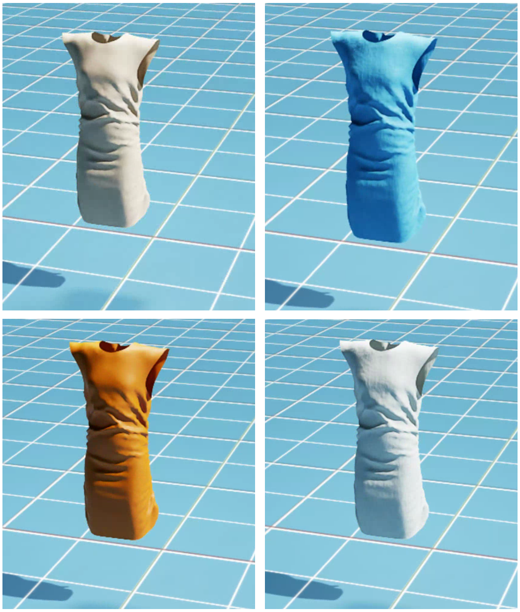

# Asset
## Garments
The clothes come from [ClothesNet](https://arxiv.org/abs/2308.09987) and are stored in .usd (Universal Scene Description) file format, with a total of more than 4,000 pieces.  
These clothes include 11 categories in total: 
Dress, Glove, Hat, Mask, One-piece, Scarf-Tie, 
Skirt, Socks, Tops, Trousers, UnderPants.  
Some of these catergories are further divided according to style, such as dresses are divided into 10 subcatergories.  

Here is a picture to give an overview of the general types of clothing.

*Figure 1: An overview of ClothesNet*
<!-- 引用clothesnet.png -->

 
If you import these clothes in the GUI, you need to select the mesh of the clothes and give it the physics properties of particle cloth, so that your clothes can be rendered correctly. If you want to view its particles, you can do so by changing visualization options.
 
<!-- 引用图片step1-4 -->

## Materials

We provide four simple materials with controllable colors for clothing. The effects are beige, blue, orange and white, as shown below.

*Figure 2: The materials provided in assets, the color order from top left to bottom right is beige, blue, orange, white*
  
If you want to use these materials, please import the material file (.usd), then find **materials on selected models** in the property column of the clothing **mesh**, and switch its path.

In the future we may add more materials, both tactile and visual, to simulate more clothes with different characteristics. 

## Robots

Our assets contains the following end-effectors: shadow hand, mobile-franka, tactile-franka.

### Shadow Hand
Shadow hands have about 20 degrees of freedom, so they are more finely controlled and can mimic the fine movements of human hands. They are often designed to perform various complex manipulation tasks such as grasping, manipulation and assembly.

*Figure 3: The shadow hands*
<!-- 插入灵巧手图片 -->

### Mobile-Franka
Mobile-Franka consists of a movable base and Franka standing on it. We can control the movement of the base by adjusting its position or speed, so that the robot can have a wider range of activities and perform more tasks more conveniently.

*Figure 4: The mobile franka*
<!-- 插入移动franka图片 -->

### Tactile-Franka

The main body of tactile franka is franka, and its gripper adheres two soft pads that can receive tactile information. This design allows the robot to combine the dexterity of Franka with tactile feedback technology. It is equipped with high-precision tactile sensors that can sense and respond to contact with the environment in real time, thereby improving the accuracy and safety of operations. This robot arm is widely used in fields that require delicate tactile operations, such as precision assembly, surgical assistance, and research experiments.
<!-- 插入Tactile franka 的图片 -->

*Figure 5: The tactile franka*
 

## Teleoperation

Teleoperation serves as a direct method to acquire human demonstrations for model training. Compared to controller-based models, we utilize the vision-based motion detection module, Leap Motion, to efficiently record human hand poses and then retarget hand poses to the dexterous robot hand.

Below is the flowchart of our implementation of teleoperation. For more information, please refer to the supplement in the paper.
<!-- 插入flowchart -->

*Figure 6: The flowchart of our teleoperation*

In our work, we implement teleoperation for Universal Robot mounted with Shadow Hand and Franka. One can control the posture of the robot by adjusting attitude and position of the hand over the detector. In particular, the open state of the gripper of Franka can be controlled by the opening and closing of the thumb and index finger.

