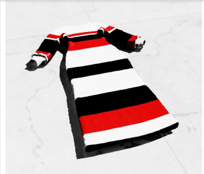
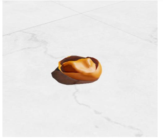
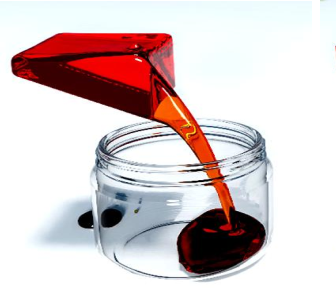
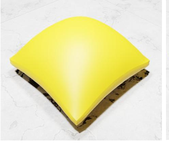
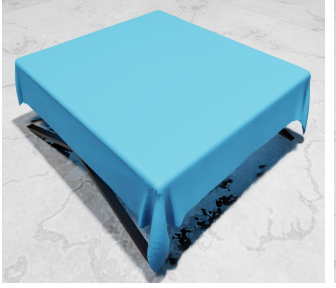
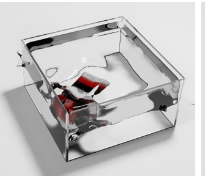
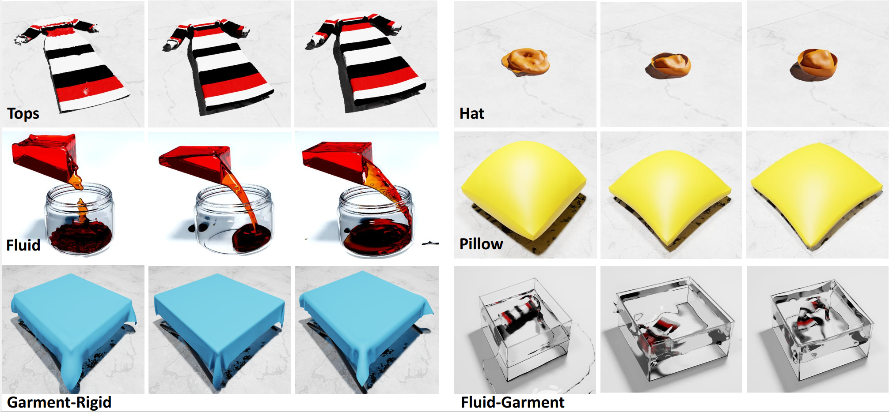

# Physics Demo
|physics |code | Simulation methodology  |Adjusted parameters|pictures|
| :----- | :-----| :------------|:---------|:---------|
|Cloth|PBD|https://github.com/GarmentLab/GarmentLab/blob/main/physxDemo/cloth.py|particle contact offset||
|Hat|FEM|https://github.com/GarmentLab/GarmentLab/blob/main/physxDemo/hat.py|Young's modulus||
|Fluid|PBD|https://github.com/GarmentLab/GarmentLab/blob/main/physxDemo/fluid-.py|cohension visicoityu||
|Pillow|PBD|https://github.com/GarmentLab/GarmentLab/blob/main/physxDemo/pillow.py|pressure||
|rigid-cloth|PBD&rigid dynamic|https://github.com/GarmentLab/GarmentLab/blob/main/physxDemo/rigid-cloth.py|contact offset stiffness bendness||
|cloth-fluid|PBD|https://github.com/GarmentLab/GarmentLab/blob/main/physxDemo/cloth-fluid.py|mass||

