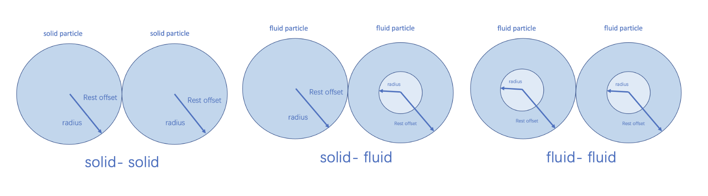

# Physics Simulation
## Modeling Methodology
### Position-Based Dynamics (PBD) for Garment
*Position-Based Dynamics (PBD)* is an efficient and stable method for simulating cloth, particularly suitable for complex garments like dresses. PBD models deformable objects as systems of interconnected particles governed by constraints that dictate their physical interactions and behaviors. In PBD, a dress is represented as a triangular mesh where particles serve as discrete points on the cloth surface with attributes such as position $x_i$, velocity $v_i$, and inverse mass $w_i$. The method operates by directly manipulating particle positions to satisfy a series of constraints, achieving stable simulations of deformable materials. These constraints include stretching constraints, which enforce distance maintenance between neighboring particles to prevent excessive elongation, mathematically defined as $C(x_i, x_j) = \|x_i - x_j\| - d $, where $d$ is the rest distance between particles $x_i$ and $x_j$. Bending constraints maintain angles between adjacent triangles in the mesh to simulate resistance to bending, formulated as $C(x_i, x_j, x_k)$, where the constraint function depends on the angle between particle triplets. Collision constraints detect and resolve collisions between particles and other objects, ensuring realistic interactions within the environment. The PBD algorithm involves initializing particles and constraints based on the dress's geometry and material properties, applying external forces such as gravity, predicting new particle positions as $\hat{p}_i = p_i + \Delta t \cdot v_i$ where $\Delta t$ is the time step, iteratively adjusting particle positions to satisfy constraints, updating particle velocities, and determining final positions for each time step.

### Position-Based Dynamics (PBD) for Fluid Simulation
*Position-Based Dynamics (PBD)* is a powerful method for simulating fluids due to its computational efficiency and stability. PBD treats fluids as collections of particles, where each particle represents a small volume of the fluid. Constraints are applied to ensure physical properties such as incompressibility and realistic fluid behavior. In fluid simulation, particles are characterized by attributes such as position $x_i$, velocity $v_i$, and inverse mass $w_i$.

A key constraint type in fluid simulation is the density constraint, which ensures that the fluid maintains a constant density. The density constraint for a particle $i$ can be defined as:
$
C_i(\mathbf{x}) = \left( \sum_j m_j W(\| x_i - x_j \|, h) \right) - \rho_0
$

Collision constraints handle interactions between fluid particles and solid boundaries, ensuring particles do not penetrate solid objects.

The PBD algorithm steps for fluid simulation include initializing fluid particles with positions, velocities, and masses, applying external forces such as gravity, computing predicted positions $\hat{p}_i = p_i + \Delta t \cdot v_i$, adjusting particle positions to satisfy density and collision constraints, updating particle velocities based on the corrected positions, and integrating the updated positions and velocities for the current time step.

### Finite Element Method (FEM) for Simulating Deformable Objects
*The Finite Element Method (FEM)* is a robust numerical technique for simulating the mechanical behavior of deformable objects, ideal for intricate geometries and diverse material properties, such as a toy bear. FEM discretizes the object into a mesh of finite elements and solves the equations of motion to accurately capture realistic deformations under various forces.

In FEM, the deformable object is represented by a mesh consisting of nodes and elements. Nodes are points where the equations of motion are solved, and elements are polyhedral shapes, such as tetrahedrons, that connect these nodes. Material properties, including elasticity, density, and damping, determine the response of the object to applied forces. Modeling a deformable body involves several key steps. First, a deformable body component is added to the mesh, which generates collision and simulation tetrahedral (tet) meshes from the source mesh. The mesh is then separated into visualization, collision, and simulation tetmeshes, each serving distinct purposes in rendering, collision resolution, and simulation. Configuring the material properties involves defining characteristics such as stiffness and dynamic friction by creating and binding a new deformable body material.

### Flow Models for Simulating Wind Effects
*Flow models* are essential for simulating wind effects, capturing the interactions between fluid (air) and objects. These models represent phenomena such as airflow, turbulence, and aerodynamic forces. The fundamental equations form the core of flow models and include the continuity equation for mass conservation $\frac{\partial \rho}{\partial t} + \nabla \cdot (\rho \mathbf{u}) = 0$, where $\rho$ is the fluid density and $\mathbf{u}$ is the velocity vector; the momentum equation for force balance $\frac{\partial (\rho \mathbf{u})}{\partial t} + \nabla \cdot (\rho \mathbf{u} \mathbf{u}) = -\nabla p + \nabla \cdot \mathbf{\tau} + \rho \mathbf{g}$, where $p$ is the pressure, $\mathbf{\tau}$ is the stress tensor, and $\mathbf{g}$ is the gravitational acceleration; and the energy equation for thermal effects $\frac{\partial (\rho E)}{\partial t} + \nabla \cdot (\rho E \mathbf{u}) = -\nabla \cdot \mathbf{q} + \mathbf{\tau} : \nabla \mathbf{u} + \rho (\mathbf{g} \cdot \mathbf{u})$, where $E$ is the total energy per unit mass and $\mathbf{q}$ is the heat flux vector.

Wind effects are modeled by defining wind sources, preparing high-resolution meshes, setting boundary conditions, configuring the appropriate flow model (e.g., LES or RANS), and running the simulation to compute wind interactions iteratively. This approach ensures accurate and dynamic representations of wind effects in various environments.

### Rigid Body Simulation
Rigid body models are essential for simulating solid objects that move and interact based on physical laws without deforming. These simulations accurately represent the dynamics of solid objects under various forces. Key components include a rigid body component, which provides properties like linear and angular velocity, and a collision component, which defines how the body collides with other objects. The dynamics of rigid bodies are governed by solvers such as Temporal Gauss-Seidel (TGS) and Projected Gauss-Seidel (PGS), which ensure stability and efficiency. TGS improves convergence by considering temporal aspects of the simulation, while PGS iteratively projects velocities to satisfy constraints. Rigid bodies interact through collisions defined by collision shapes, which can be approximated using convex hulls, bounding shapes, or signed distance fields (SDFs). These approximations balance accuracy and computational performance. Mass properties of rigid bodies are derived from the volume and density of their collision geometries. For more precise control, explicit mass or density values can be set using a Mass component. This allows for accurate simulation of complex interactions and dynamic behaviors.

## Multi-Physics Simulation Parameters Table
To maximize the value of different simulation methods, we assigned different parameters to various objects. In the table: physics, we list all the adjustable parameters.

| Type | Parameters | Function | Range |
|------|------------|----------|-------|
| Garment | Particle Contact Offset | Distance at which particles start interacting | 0.03 - 0.12 |
| | Contact Offset | Distance at which collisions are detected | 0 - 16384 |
| | Rest Offset | Distance at which particles are in resting contact | 0 - 0.05 |
| | Solid Rest Offset | Distance for particle-solid interactions | Default |
| | Fluid Rest Offset | Distance for particle-fluid interactions | Default |
| | Solver Position Iteration Count | Number of iterations for solver to satisfy constraints | 6 - 255 |
| | Max Depenetration Velocity | Maximum speed at which particles are separated when overlapping | inf |
| | Max Neighborhood | Maximum number of neighboring particles for interactions | 36 - 512 |
| | Density | Mass per unit volume of the material | default |
| | Friction | Resistance to sliding motion | default |
| | Damping | Reduction of motion or oscillations | default |
| | Viscosity | Internal friction within the fluid material | default |
| | Cohesion | Attractive force between particles | default |
| | Surface Tension | Elastic tendency of the material's surface | default |
| | Drag | Resistance experienced when moving through fluid or air | default |
| | Lift | Force acting perpendicular to fluid flow around the material | default |
|Fluid | Particle Contact Offset | Distance at which particles start interacting | 0.17 - 0.3 |
| | Contact Offset | Distance at which collisions are detected | default |
| | Rest Offset | Distance at which particles are in resting contact | 0.03 - 0.3 |
| | Solid Rest Offset | Distance for particle-solid interactions | 0.1-0.2 |
| | Fluid Rest Offset | Distance for particle-fluid interactions | 0.1-0.15 |
| | Solver Position Iteration Count | Number of iterations for solver to satisfy constraints | 6 - 255 |
| | Max Depenetration Velocity | Maximum speed at which particles are separated when overlapping | inf |
| | Max Neighborhood | Maximum number of neighboring particles for interactions | 36 - 512 |
| | Density | Mass per unit volume of the material | 0 - 1e10 |
| | Friction | Resistance to sliding motion | 0 - 0.2 |
| | Damping | Reduction of motion or oscillations | 0 - 10 |
| | Viscosity | Internal friction within the fluid material | 1e3 - 1e6 |
| | Cohesion | Attractive force between particles | 0 - 100 |
| | Surface Tension | Elastic tendency of the material's surface | 0 - 100 |
| | Drag | Resistance experienced when moving through fluid or air | 0 - 78 |
| | Lift | Force acting perpendicular to fluid flow around the material | 0 - 1e10 |
| Deformable Body | Vertex Velocity Damping | Rate of reduction of vertex velocities | 0 - 10 |
| | Simulation Mesh Resolution | Granularity of the simulation mesh | 10 |
| | Solver Position Iterations | Number of iterations for solver to satisfy positional constraints | 8 - 255 |
| | Sleep Threshold | Velocity below which the body is considered to be at rest | 0 - 1e7 |
| | Settling Threshold | Velocity below which the body is considered to have settled | 0 - 1e7 |
| | Sleep Damping | Additional damping as the body approaches the sleep threshold | 0 - 1e7 |
| | Contact Offset | Distance at which collisions are detected | -inf |
| | Rest Offset | Distance at which particles are in resting contact | -inf |
| | Self Collision Filter Distance | Minimum distance to avoid self-collision | -inf |
| | Remeshing Resolution | Resolution for remeshing the input mesh | Default |
| | Target Triangle Count | Target resolution for quadric simplification | Default |
| | Max Depenetration Velocity | Maximum speed at which vertices can be separated when overlapping | inf |
| | Density | Mass per unit volume | Default |
| | Dynamic Friction | Resistance to sliding motion | 0 - 2048 |
| | Young's Modulus | Stiffness of the material | 1e3 - 1e10 |
| | Poisson's Ratio | Ratio of transverse to axial strain | 0 - 0.499 |
| | Elasticity Damping | Reduction of oscillations and vibrations | 0 - 0.05 |
| | Damping Scale | Adjusts the overall damping effect | 0 - 1.0 |
|Rigid Body | Max Linear Velocity | The rate of change of position of the rigid body. | 0-50 |
| | Max Angular Velocity | The rate of change of rotation of the rigid body. | 0-1e10 |
| | Collision Shape | Defines the shape used for collision detection. | default |
| | Contact Offset | Distance from the surface where collisions are detected. | -inf-inf |
| | Rest Offset | Effective contact distance from the surface. | -inf-inf |
|  | Convex Hull | Approximation method for collision shape. | 0-64 |
| | SDF (Signed Distance Field) | Approximation method using signed distance field. | default |
| | Mass | Defines the mass of the rigid body. | 0 to Inf |
| | Density | Defines the density of the rigid body material. | 0 to 1000 |
| | Friction | Resistance to sliding motion. | 0 to 1 |
| | Restitution (Bounciness) | Degree of elasticity of collisions. | 0 to 1 |
| | Material Density | Density of the material applied to the rigid body. | 0 to 1000 |
| Flow | X-Component | Flow rate in the x-direction | -inf-inf |
| | Y-Component | Flow rate in the y-direction | -inf-inf |
| | Z-Component | Flow rate in the z-direction | -inf-inf |
| | Magnitude | Overall magnitude of the flow | 0-inf |

## Parameter Effects on Physical Properties
In most cases, changes in parameters do not significantly alter the physical properties. For PBD simulations involving garment, the Particle Contact Offset parameter affects the thickness of the fabric; as its value increases, the fabric becomes progressively thicker. The Rest Offset parameter influences the distance between the dress and the ground upon landing, with an increase in this value resulting in a greater distance between the dress and the ground after it lands.

For PBD simulations involving fluid, the Velocity parameter affects the flow rate of the liquid; as its value increases, the liquid flows faster. The Cohesion parameter affects both the shape and flow rate of the liquid; at lower values, the liquid falls quickly and splashes out. As the value increases, the liquid flow slows down and splashing decreases, eventually leading to a smooth flow. The Particle Contact Offset parameter affects the form of the liquid as it falls; as its value increases, the liquid transitions from a continuous stream to a segmented, chunk-like flow.

In simulations involving deformable bodies, the Vertex Velocity Damping parameter affects the fall speed of objects such as hats; as the value increases, the fall speed decreases gradually. The Settling Threshold parameter also influences the fall speed of hats; increasing its value results in a slower fall speed, but once the value exceeds 1, the fall speed stabilizes. The Elasticity Damping parameter impacts the shape of the hat; as the value increases, the hat gradually collapses from a firm structure to a flat plane. The Young’s Modulus parameter also affects the shape of the hat; at lower values (around 1e3), the hat collapses into a smaller height. As the value increases, the hat becomes firmer, and when the value reaches around 1e4, the hat initially stays firm and then gradually collapses. At a value of 15000, the hat remains completely firm.

For rigid body simulations, the Max Linear Velocity parameter affects the fall speed of rigid bodies such as hats; as the value increases, the fall speed decreases. When the value exceeds 50, the object practically stops falling.

In the context of flow simulations, the X-Component, Y-Component, and Z-Component parameters together determine the direction of the wind vector, while the Magnitude parameter determines the strength of the wind.

*Figure 1: Different Types of Particle-Particle Interaction*

